# Trivishna

Trivishna is a workflow-driven travel booking and management platform built using Django. The platform enables users to explore travel packages, manage bookings, upload payment proofs, receive automated email notifications, and interact with a chatbot-assisted navigation system through a structured and responsive web application.

The project was designed to simulate real-world booking and admin verification workflows commonly used in travel and service management platforms.

---

# Project Overview

Trivishna provides a complete booking workflow experience with:

- User authentication and role-based dashboards
- Dynamic travel booking system
- Cart and booking management
- Manual payment verification workflow
- Email automation system
- AI-assisted chatbot navigation
- Review and feedback system
- Admin-side booking monitoring
- Dynamic traveller information handling
- Trip planning integration

The application focuses heavily on backend workflow implementation, database-driven architecture, and real-world booking management concepts.

---

# Key Features

## Authentication System
- User signup and login
- Email-based password reset functionality
- Custom user model implementation
- Session-based authentication workflow
- Role-based dashboard system

---

## Travel Package Management
- Browse travel destinations and packages
- View package details and pricing
- Filter available travel packages
- Explore trip information dynamically

---

## Dynamic Booking Workflow
- Book travel packages directly
- Dynamic traveller detail forms based on passenger count
- Preferred travel date selection
- Booking management dashboard
- Booking cancellation functionality

---

## Cart System
- Add travel packages to cart
- Manage selected packages
- Proceed through booking workflow
- Cart-based travel planning experience

---

## Payment Proof Verification Workflow
- Upload payment proof screenshots
- Manual payment verification system
- Admin-side payment approval process
- Automated booking confirmation workflow

This workflow simulates real-world manual verification systems used in travel and service platforms.

---

## Email Automation System

Automated emails are triggered for:
- Password reset requests
- Booking confirmations
- Payment proof submissions
- Payment verification approvals
- Booking-related notifications

---

## Chatbot Navigation Assistant
- Interactive chatbot integration
- User-guided navigation support
- Conditional redirection based on authentication state
- Smart navigation assistance for packages and bookings

---

## Admin Dashboard
Admin users can:
- Monitor bookings
- Verify payment proofs
- Track user activities
- Manage travel workflows
- Access booking analytics

---

## Review & Feedback System
- Submit travel package reviews
- User feedback collection
- Booking experience interaction

---

# Project Architecture

The application follows a database-driven Django architecture with:

- Django authentication system
- SQLite database integration
- Media upload handling
- Session-based user management
- Role-based access control
- Email notification services
- Dynamic frontend rendering

---

# Tech Stack

## Backend
- Python
- Django

## Frontend
- HTML5
- CSS3
- JavaScript

## Database
- SQLite

## Additional Integrations
- OpenAI API
- Google Maps API
- SMTP Email Service

## Tools & Platforms
- Git
- GitHub
- VS Code
- PyCharm
- Render

---

# Screenshots

## Homepage
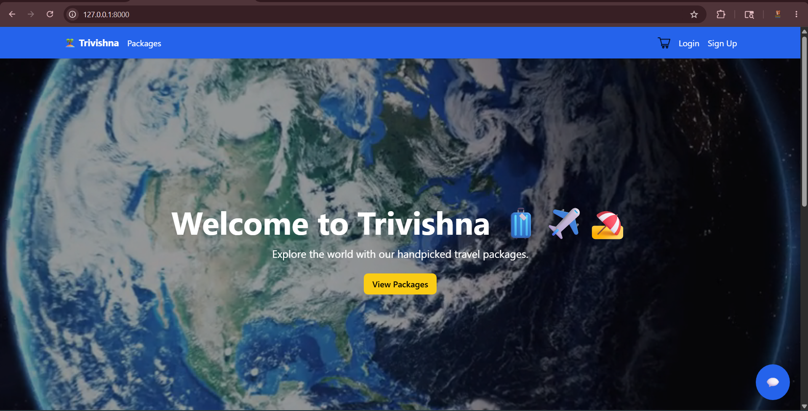

---

## Travel Packages
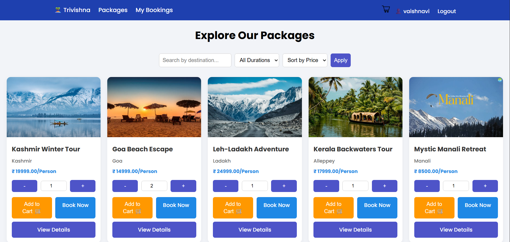

---

## Package Details
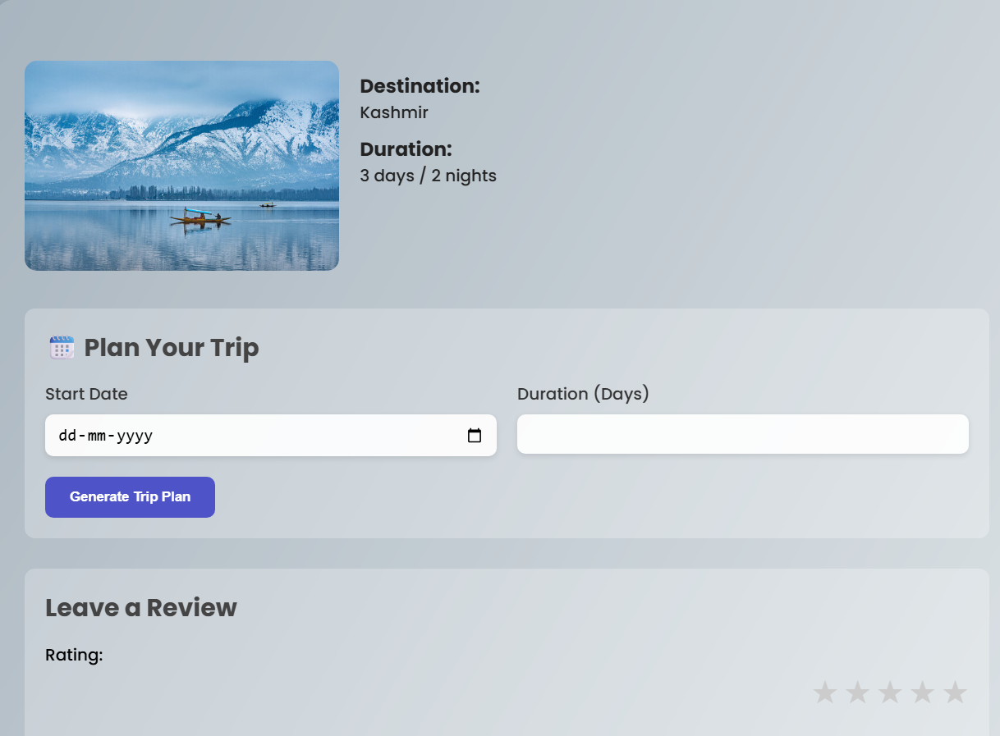

---

## Dynamic Booking Form
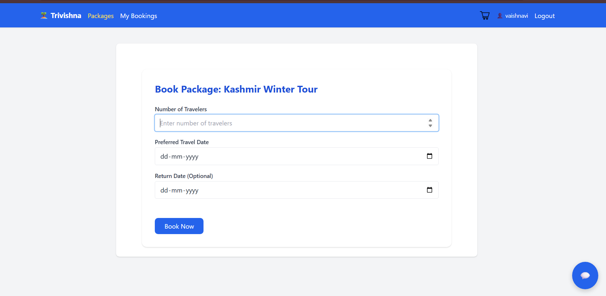

---

## User Dashboard
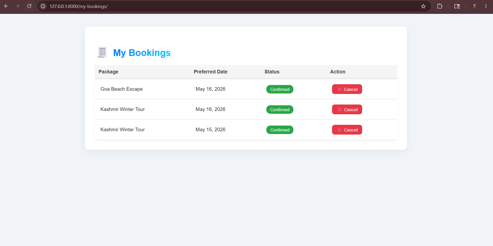

---

## Admin Dashboard
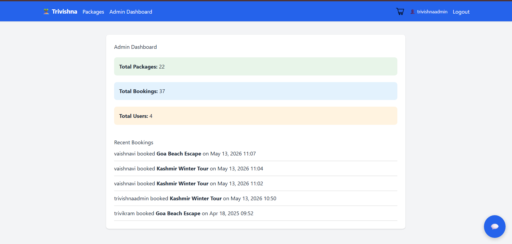

---

## Chatbot Assistant
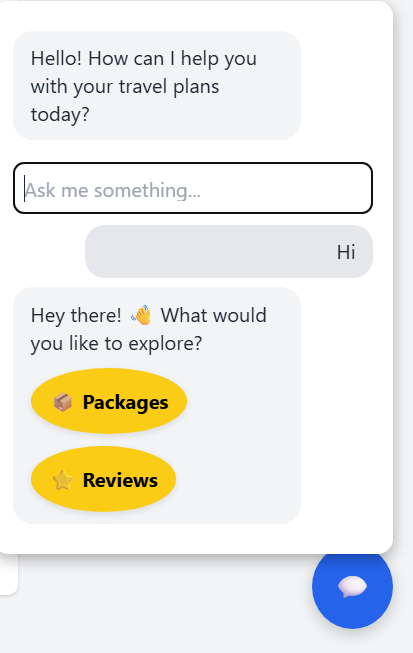

---

## Payment Proof Upload
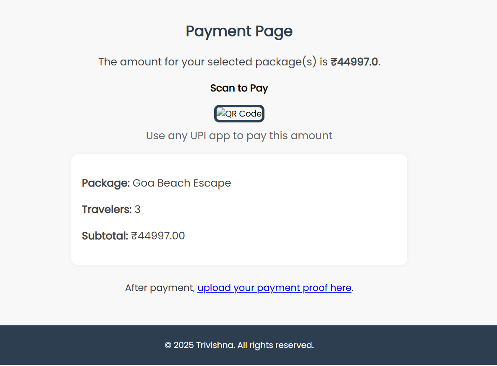

---

## Upload Success Workflow
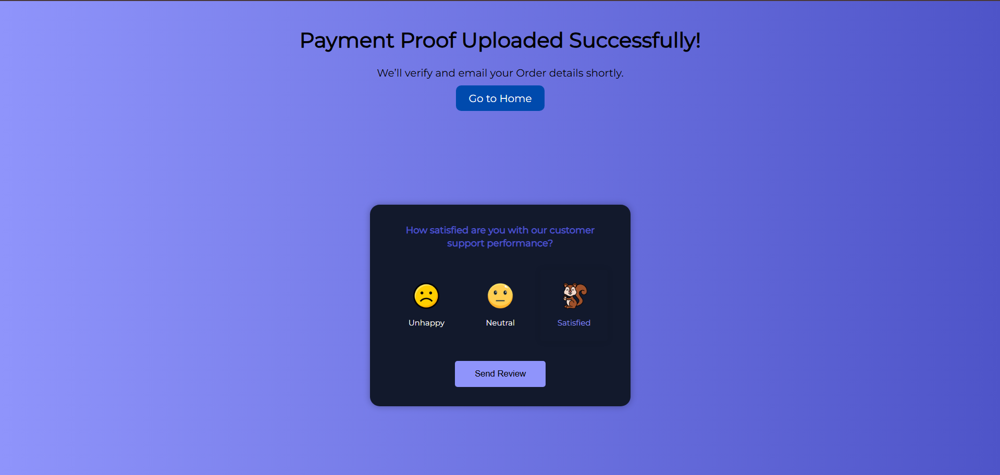

---

## Booking Feedback System
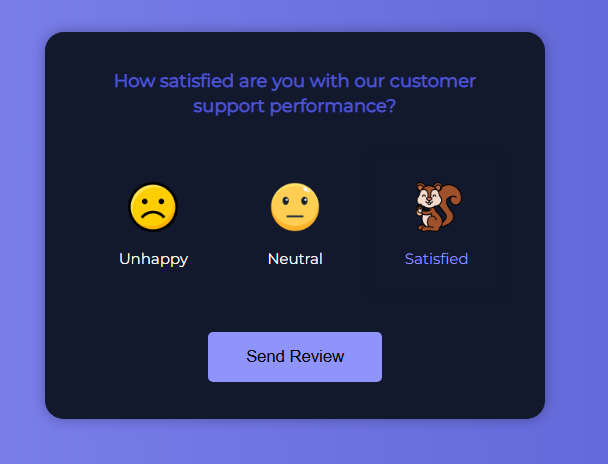

---

## Booking Confirmation Email
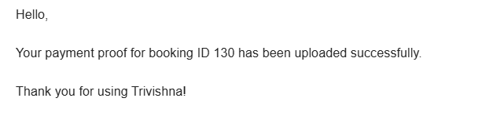

---

## Payment Verification Confirmation
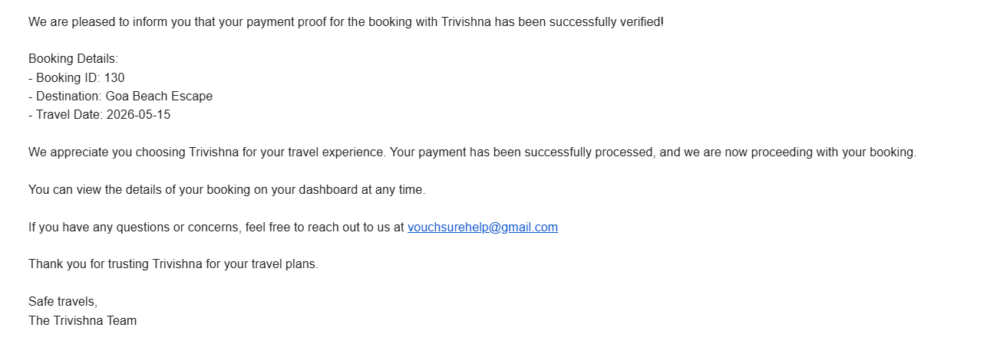

---

# Installation & Setup

## Clone Repository

```bash
git clone https://github.com/srivaishnavipeddada/Trivishna.git
```

## Navigate to Project Directory

```bash
cd Trivishna
```

## Create Virtual Environment

```bash
python -m venv venv
```

## Activate Virtual Environment

### Windows

```bash
venv\Scripts\activate
```

## Install Dependencies

```bash
pip install -r requirements.txt
```

## Create `.env` File

Add the following environment variables:

```env
DJANGO_SECRET_KEY=your_secret_key

EMAIL_HOST_USER=your_email@gmail.com
EMAIL_HOST_PASSWORD=your_app_password

GOOGLE_API_KEY=your_google_api_key

OPENAI_API_KEY=your_openai_api_key
```

## Apply Migrations

```bash
python manage.py migrate
```

## Run Development Server

```bash
python manage.py runserver
```

---

# Future Improvements

- Online payment gateway integration
- AI-based itinerary generation
- Real-time booking tracking
- Travel recommendation engine
- Advanced analytics dashboard
- REST API integration
- Mobile application support
- Multi-user booking management
- Cloud storage integration

---

# Learning Outcomes

This project helped improve practical understanding of:

- Django backend architecture
- Authentication systems
- Workflow-driven application development
- Database design and relationships
- Dynamic form handling
- Email automation
- File upload management
- Admin workflow systems
- Git and GitHub workflow management
- Deployment-ready project structuring

---

# Author

## Sri Vaishnavi P

Python & Django Developer

GitHub: https://github.com/srivaishnavipeddada
